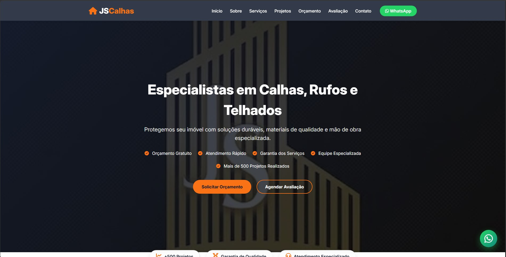

# 🛠️ JsCalhas - Site Institucional 

[](LICENSE)
[](https://developer.mozilla.org/en-US/docs/Web/HTML)
[](https://developer.mozilla.org/en-US/docs/Web/CSS)
[](https://developer.mozilla.org/en-US/docs/Web/JavaScript)

Site profissional para empresa especializada em **Caslhas, rufos e telhados**. Desenvolvido com foco em conversão, experiência mobile e otimização para leads.

## 📸 Prévia do Projeto 

## Página Inicial - Hero Section 


*Banner principal com chamada para ação e cards fluentes de beneficios*

## 🖥️ Demonstração

[🔗 Visualizar Projeto](https://seusite.com) *(em breve disponivel)*


## 💿 Funcionalidades 
- ✅ **Desing Responsivo** - Adaptado para desktop
- ✅ **Simulador de Orçamento** - Cáculo atomático com envio via WhatsApp
- ✅ **Galeria de Projetos** - Filtros por categorias (calhas/rufos/telhados)
- ✅ **Agendamento de Visitas** - Formulário com data e horário
- ✅ **Slider de Depoimentos** - Carrossel automático com avaliações
- ✅ **FAQ Interativo** - Accordion com perguntas frequentes
- ✅ **Botão Flutuante WhatsApp** - Animação e tooltip
- ✅ **Modal de Imagens** - Visualização ampliada da galeria
- ✅ **Scroll Reveal** - Animações suaves ao rolar a página
- ✅ **Sticky Header** - Menu fixo com blur effect


## 🔨 Tecnologias Utilizadas

| Tecnologia | Descrição |
|------------|-----------|
| HTML5 | Estrutura semântica da página |
| CSS3 | Estilização moderna com Flexbox/Grid |
| JavaScript | Interatividade e dinamismo |
| Font Awesome 6 | Ícones vetoriais |
| Google Fonts (Inter) | Tipografia moderna |
| Intersection Observer API | Animações de scroll |
| Local Storage (opcional) | Persistência de dados |

## 📁 Estrutura do Projeto

```text
JSCalhas/
│
├── index.html            # Página principal
├── README.md
│
├── assets/
│   ├── JSCalhas.png      # Logo e imagem hero
│   └── img/              # Imagens do projeto
│
├── css/
│   └── style.css         # Estilos principais
│
└── js/
    └── script.js         # JavaScript completo
```

## 📱 Responsaivade 
| Breakpoint | Largura | Comportamento|
|------------|-----------|------------|
| Desktop | > 99spx | Layout Completo |
| Tablet | 768px - 991px | Menu Hambúguer ativo |
| Mobile | < 768px  | Empilhamento vertical 

##

